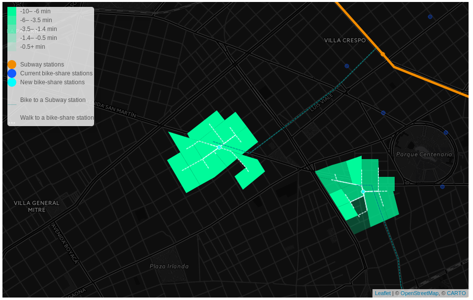

# bikeBA
Buenos Aires City is the capital and largest city of Argentina (almost 3 million inhabitants). The Greater Buenos Aires conurbation constitutes the fourth-most populous metropolitan area in the Americas, with a population of around 17 million. The subway is the most popular (near 30 million users monthly) and fastest (26 minutes average time from the peripheral terminals to Downtown) mode of transit. Nevertheless, the subway network is not so well spread. This leaves zome areas of the city poorly connected to downtown. As many cities, Buenos Aires has a bike-share system called Ecobici with 179 thousands registered users. It is totally free of charge and has more than 83 stations. At the same time, the city has one of the most extended network of protected and exclusive bike-lanes (158 km) that makes Buenos Aires the 14th most bikeable city in the world according to copenhagenize.org. Evenso, bike-share stations are located in the downtown area, in competition rather than cooperation with the subway. We propose to deploy bike-share stations in the peripherals areas as a way to improve access to the subway network in a smart, flexible, low-cost and environmentally friendly way. The main idea is for people living close (but not close enough to walk) to a subway station, can bike to the subway and from there to work.We assumed that all of the subway stations would have a bike-share station on the entrance.

Some areas in Buenos Aires are relatively close to subway lines, but not close enough for people to walk there. We though that bike-share could be used to fill this gap, as a multimodal transport option for the daily commute. So, we wanted to come up with the best locations for new bike-share stations in areas that are close enough to subway stations that people could bike to them, but not close enough that people would walk.

You can see the full work and how it was done [here](https://alephcero.github.io/bikeBA/)

## Full final map

## Example map

## Techniques:

* We used **service area** in network analysis to come up with buffer areas for:
	* 350 meters as walking distance to the subway
	* 2500 meters as bikeable distance to the subway (those who walk won't bike)

* Within the *bikeable area* to the subway we used **Location Allocation** maximizing attendance to come up with ideal locations for the new bike share stations

* For weights in the **Location Allocation** we use, for each census block, the sum of:
	* Total population within 18 and 50 years (in standar deviations)
	* Time in minutes it takes from each census block centroid to dowtown (in standar deviations)
	* Cost in argentine pesos it takes from each census block centroid to dowtown(in standar deviations)

* We evaluated the new time it takes combining bike and subway using [Google API Distance Matrix](https://developers.google.com/maps/documentation/distance-matrix/). The code is in [this project here](https://github.com/alephcero/baCommuteMatrixMap). Google didn't implemented *bike* as a mode of transit, so we estimated a average velocity of 10 km/h using a study carried in Lyon, France.

## Main results

Combining bikeshare and subway in the commute reduces trip time by:

| Statistic	| Reduction in minutes 	| Reduction in % |
| ------------- | ------------- 	| -------------- |
| Mean		| 6:48		  	|15,0 %|
| 25 percentile | 9:11			|22,8 %|
|50 percentile|5:16|12,7 %|
|75 percentile|2:43|6,4 %|

